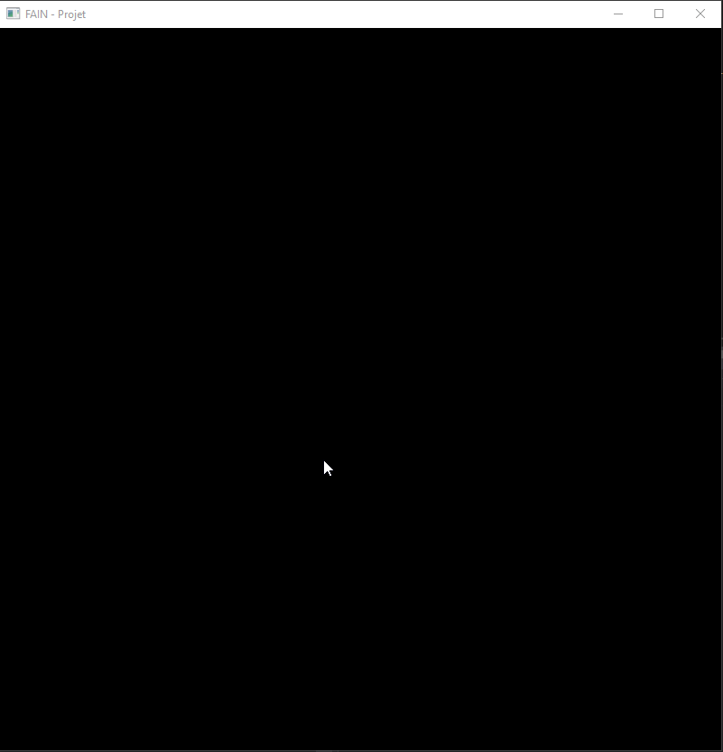

# Projet Fondements et Algorithmique de l'Imagerie Numérique

## Comment compiler le projet

Pour compiler le projet il faut avoir au sein de son système CMake d'installé. Après lancer la commande dans le repertoire du projet : `cmake-gui .` pour lancer la fenêtre CMake.
Puis de cliquer sur le bouton "Configurer" et enfin choisir le compilateur voulu (bien sûr il faut également avoir les librairies freeglut et opengl dans le système cible avec le compilateur cible).
Sur Linux choisir "Unix Makefiles". Enfin, il suffit de cliquer sur générer pour que CMake génére le Makefile associé, qui sera dans le repertoire spécifié pour la "build".
Maintenant il suffit de faire un `make` pour que le projet soit compilé. 

## Exemples

Lancer le programme générer sans arguments (par défaut fenêtre de 800 * 800 pixels).

### Insertion de sommets

Appuyer sur "i" pour passer en mode insertion.

### Selection d'un sommet

Appuyer sur "v" pour passer en mode sommet (vertex). Puis selectionner avec la souris le sommet voulu.

### Suppression d'un sommet

Appuyer sur "v" pour passer en mode sommet (vertex). Puis selectionner avec la souris le sommet voulu. Et enfin appuyer sur "Del" ("Suppr") pour supprimer le sommet.

### Bouger un sommet

Appuyer sur "v" pour passer en mode sommet (vertex). Puis selectionner avec la souris le sommet voulu. Et enfin utiliser les touches haut, bas, gauche, droite du clavier pour bouger le sommet.

### Fermer le polygone

Appuyer sur "c" pour ouvrir/fermer le polygone. Le nombre de sommet doit être supérieur à 2.

### Remplissage

Appuyer sur "f" pour remplir le polygone (fermé).

### Selection de l'arête

Appuyer sur "e" pour passer en mode arête (edge). Puis utiliser les touches "PageUp" et "PageDown" pour selectionner une arête.

### Division de l'arête

Appuyer sur "e" pour passer en mode arête (edge). Puis selectionner une arête et enfin appuyer sur le bouton du milieu de la souris pour subdiviser l'arête.

## Ce qui a été fait

- [x] Afficher une ligne brisée (bresenham)
- [x] Dessin à la souris
- [x] Remplissage scan-line
- [x] Insérer et supprimer des sommets
- [x] Sélection par clavier
- [ ] Sélection par souris
	* [x] Sélection du sommet le plus proche
	* [ ] Sélection de l'arête la plus proche